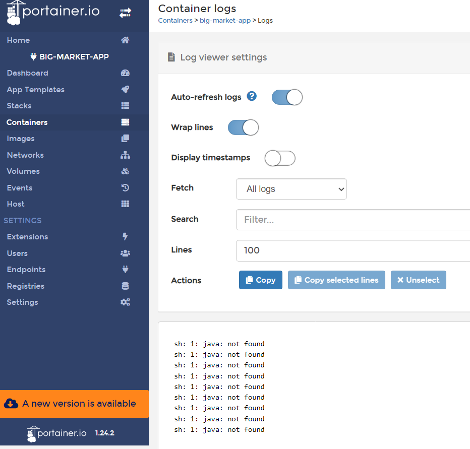

### 后端问题



### 任务

- [x] 规则引擎量化人群参与活动

## 总结

首先先去了解了一下组合模式和决策树，然后看了看数据库，其实就是把一个类似于二叉树的结构存到了数据库里，分别对应了三个东西，一个表用来保存决策树的树根信息，然后一个表用来保存树上的所有节点的信息，然后一个表用来存决策树的连接信息，我们可以通过树根的 ID 拿到所有相关的连线信息以及所有相关的节点信息，明白了数据库相关的东西之后屡屡代码结构

什么是组合模式呢？先看看维基百科对组合模式的定义，然后直接看代码，给我的第一感觉就是把每一个 if-else 的条件抽取出来，然后变成一个又一个的 filter，然后在规则引擎中进行使用，首先把一个个 filter 包装到 map 中，供子类使用

其中最重要的代码我觉得是这个：

```java
    protected TreeNodeVO engineDecisionMaker(TreeRuleRich treeRuleRich, DecisionMatterReq matterReq) {
        TreeRootVO treeRoot = treeRuleRich.getTreeRoot();
        Map<Long, TreeNodeVO> treeNodeMap = treeRuleRich.getTreeNodeMap();
        Long rootNodeId = treeRoot.getTreeRootNodeId();
        TreeNodeVO treeNodeInfo = treeNodeMap.get(rootNodeId);
        while (Constants.NodeType.STEM.equals(treeNodeInfo.getNodeType())) {
            String ruleKey = treeNodeInfo.getRuleKey();
            LogicFilter logicFilter = logicFilterMap.get(ruleKey);
            String matterValue = logicFilter.matterValue(matterReq);
            Long nextNode = logicFilter.filter(matterValue, treeNodeInfo.getTreeNodeLineInfoList());
            treeNodeInfo = treeNodeMap.get(nextNode);
        }
        return treeNodeInfo;
    }
```

1. 获取树根节点信息
2. 获取树根所对应的所有节点信息
3. 判断每个节点是不是叶子节点
   1. 如果不是，就执行决策，如果通过就返回下一个节点
   2. 如果是叶子节点，也就是找到了对应的活动号，表示可以参与

那么就可以将代码结构分为两个部分，一个是决策者，提供决策相关逻辑，一个是执行者，对决策链条进行链路执行，然后返回最终结果，那么到这里应该代码逻辑就清晰了，决策者根据一定的比较规则，返回 ture 或者 false，执行者根据这个结果来判断是否要继续进行下一个判断，直到判断到叶子节点

了解了这个之后代码就好写了

感觉这个章节最大的难点就在于如果之前没有设计模式基础的话，会很难受，代码跳过去跳过来有时候找不到方向，一般我遇到这种情况的时候我就会梳理一下业务逻辑，代码结构无论怎么变，也一定是根据业务逻辑来的，之前做的事情一样不少，所以就按照自己想的逻辑去代码中找对应，去看看哪里做的比较，哪里拿到的链路结构，这样就将大问题化成了小问题，然后去对应代码中的每一个部分，这里也就是将逻辑执行步骤进行“打散”的过程，找到了每段代码对应那一段逻辑之后，看一看代码的继承体系，大概也就了解个七七八八了